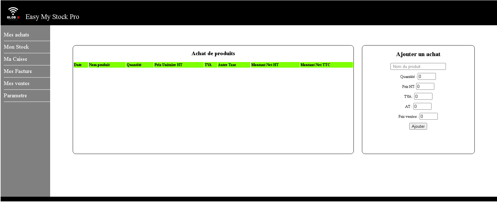

# EMS
EMS

# Easy-My-Stock

  You were many asking for a stock management system so we( Global Analysis Tech ) decide to build easy my stock a beauty-full management system helping you storing information about your currents stocks of products, your sells.  Archiving your news acquisition of the product. It checkout the management system permits facture generation and could be served in your enterprise network.  Hope you enjoy this tool...  Features stocks management system facture generation checkout with automatic stock retranching Sells data archeiving

## Welcome to Mail Scraper Pro Project

  I start this project in 2020, because on of my friend ( Accountant ) ask me for a way to automatising the process of stock management so i start coding this software.It was an open source project, but now the devellopement process is finish . enjoy using...

## Introduction

  In the sub région of West Africa People aving trouble automate they stock management system because most of entreprise don't have suffisant fund to invest in such of software management system. But even if they cost are sometime high investing in a stock management system would help them increase them efficacity and Business intelligence; in addition in a world of large scaling and artificial intelligence driven entreprise having real time data of market entry and sorty could help manager and acountant make the right decision at the right time. Easy My Stock help them archiving those kind of data and being update in term of technologie those include end user and manager education. The next step should be to implement a cloud based IA who would recieve data form entreprise analysing them and help manager decide.

## Features

- procurement management
- sells management
- checkout sytem
- invoice management

## Installation

  Easy My Stocks is a portable web application this mean that you can at anytime move it in any folder of your central server and easly migrate him to an over machine.
so let talk about instalation :

First : Download the Easy My Stocks.zip file at the following addresse : https://sourceforge.net/projects/easy-my-stock/
  After the dowload finish unzip it in the folder you wich to intall it you should get something like that :
  > 

Now locate the Easy My Stocks Pro.exe file and run it ( no administrator right requiered )
  Execute by double clicking on it a server log console would open showing you about interaction 
  > 
  
You get prompted that the server is runing on http://localhost:6027 . Open the link in your browser the web page lunch on procurement management page and ask you about administrator password for logging in the default password is : $*12Lm!D==<Sddd@fjk!:
 > 

Click on parametre for entering your entreprise information and reseting your password 
> 
> Social reason
> Addresse
> Telephone
> RCCM
> IFU
> Imposition Regime
> Geographique addresse

Entering data and click on enregistrer
Then change your password and go back to the procurement management by clicking on Achats and start registering your products acquition
> 

So for exemple you buy 30 box of cookies ParleG you just have to fill the form as follow and click on ajouter :
> 

Your stock is automatically updated in the purchase window as well as the Mon Stocks window
> 

You can now pass to the checkout windows and archieving sells
> 
> As you see you can automaticly add customer information and those data would be archieved and consultable in the facture windows
> 

You also view all transaction history sorted by time in the Mes Ventes windows
> 

## Buy Me A Coffe
Perfect Money : U289663800
BTC : bc1qxm4e7fr0w9vv73qn4lmnxp4u5ekgndxx33trhk

## Contact info :
email : prof.alex.wolf@gmail.com 
whatsapp : https://wa.me/+22672587871
